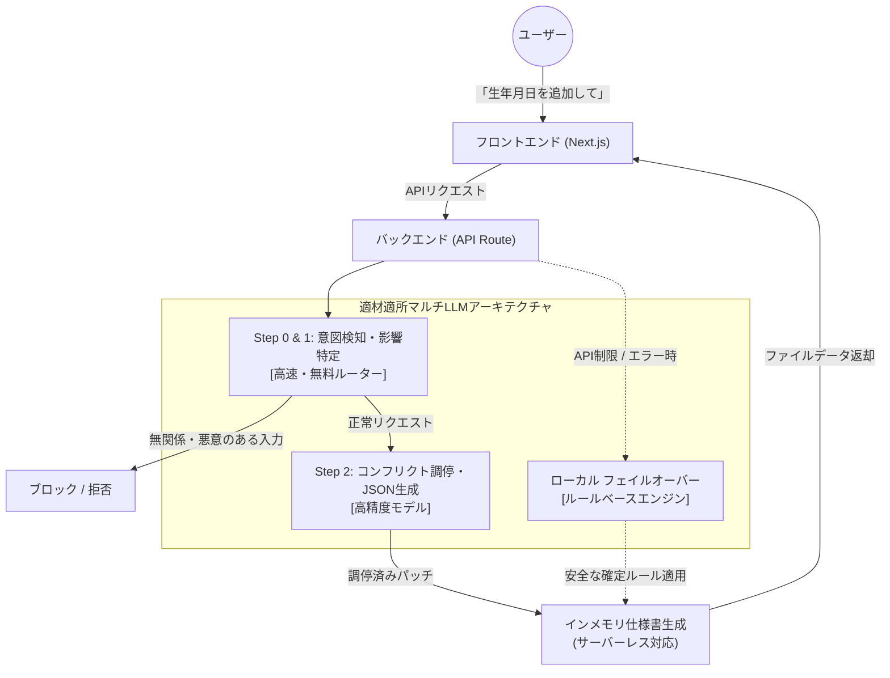

  <h1>🤖 Weaver</h1>
  
<strong>仕様書の矛盾を自動検知・調停するAIエージェント</strong>

## 🌐 Demo

デモアプリ（Vercel）: https://weaver-new.vercel.app/

> ※ クラウド環境ではローカルファイルアクセスができないため、Vercel上のデモ環境はインメモリで動的に生成されたExcel仕様書に対する「モック動作」となります。フル機能（実ファイルの直接更新・Slack通知）をお試しいただく場合は、ローカル環境で実行してください。

---

## 📖 プロダクト概要

お客様の要求追加や仕様変更が発生した際、画面設計、API設計、DB定義といった複数の設計書の「整合性」を手作業で追従・管理するのは、時間的にも精神的にも限界があります。

**Weaver** は、自然言語のリクエストから影響を受ける仕様書をAIが自律的に特定し、コンフリクト（矛盾）を論理的に調停した上で一括更新するAIエージェントです。分断された仕様書とコード、そして開発者同士のコミュニケーションを「綺麗に編み直す（Weaveする）」というコンセプトを込めて開発されました。

## ✨ 主な特徴 (5つの柱)

1. **Human-in-the-loopの自律調停**
   AIが既存のDB定義やAPI仕様を読み込み、論理的な矛盾を自己解決します。ただし適用前には必ず人間がUI上で承認（Approve）を行う安全なフローを採用しています。
2. **意図検知によるセキュリティ**
   悪意のあるプロンプト（「仕様書を全部消して」等）を防ぐため、高速モデルによる「Step 0（意図検知）」のゲートウェイを設け、安全なリクエストのみを処理します。
3. **マルチLLMによる圧倒的コストパフォーマンス**
   `OrcaRouter` を活用し、単純な意図検知は無料モデルで、複雑な調停は高性能モデルで行うルーティングを構築。UXを損なうことなく、エンタープライズに最適なTCOを実現しています。
4. **ローカル実ファイル同期 ＆ Slack通知**
   ローカル実行時は、実際のExcelファイルをNode.jsが直接読み書きして上書き保存します。同時にSlackへBlock Kitを用いた美しい更新通知を飛ばし、現場の「サイレント修正」を防ぎます。
5. **フェイルオーバーによる堅牢性**
   LLM APIのダウンやタイムアウト時は、ローカルの非AIルールベースエンジンへ瞬時に切り替わるフェイルオーバー機構を備えています。

## 🏗 アーキテクチャ

## 🛠 技術スタック

- **Frontend / Backend:** Next.js (App Router), Tailwind CSS
- **LLM Orchestration:** OrcaRouter
- **File Handling:** `exceljs`
- **Notification:** Slack API
